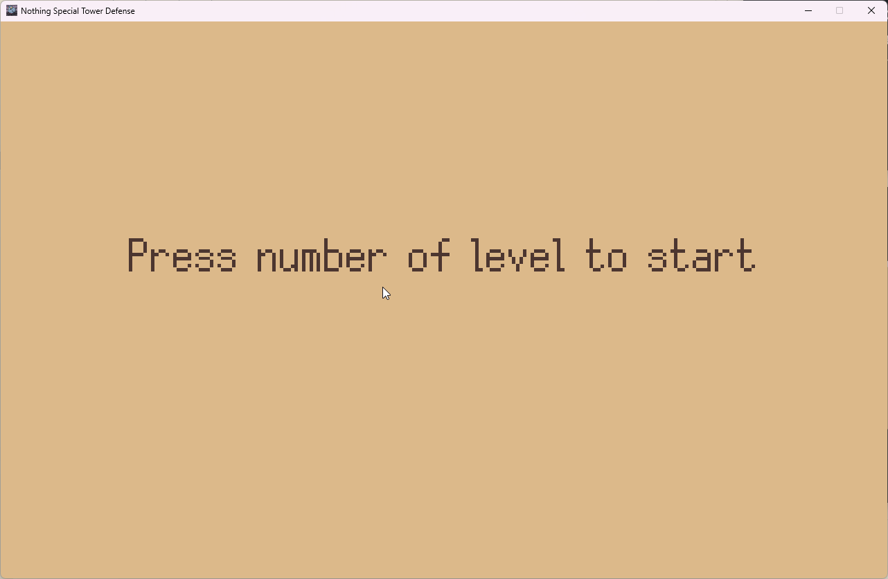
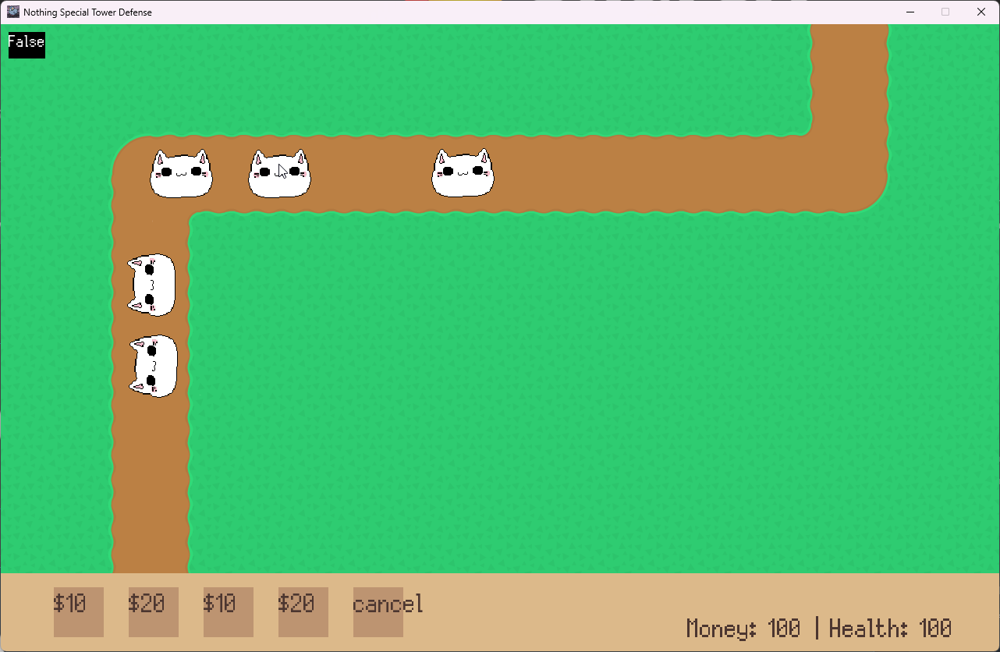
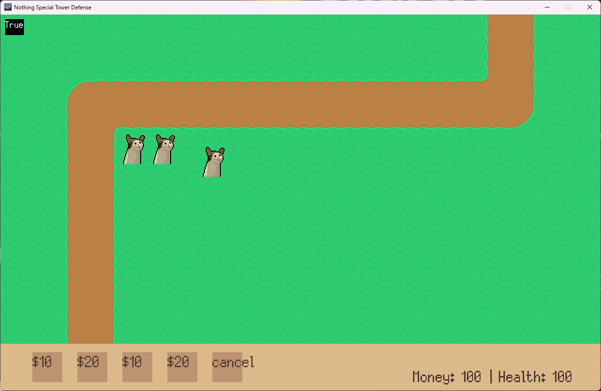
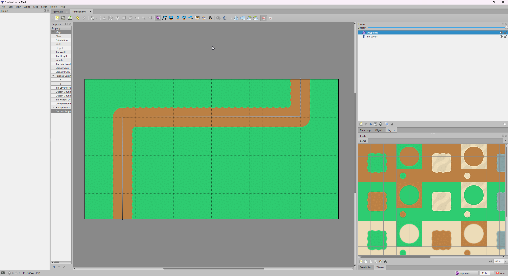

Проект по теме Pygame

# Nothing Special Tower Defense

```
Выполнил: Коканов Павел
Руководитель: Токаревская Светлана
```

---

## Цель игры
Цель игры заключается в защите базы от волн врагов, идущих по определенному пути, с помощью постройки защитных башен.

---

## Задачи
- Изучение принципов работы игр на pygame
- Разработка логики работы игры
- Создание меню игры
- Подключение и создание различных уровней

---

## Структура проекта
- assets - ассеты игры (аудио, шрифты, спрайты)
- levels - уровни для игры
- button.py - отвечает за кнопки в магазине
- enemy.py - класс врагов
- inventory.py - класс инвенторя (магазин)

---

- level.py - класс уровня (соединение уровня и врагов)
- loader.py - класс загрузки уровня и создания клетчатого поля
- main.py - запуск игры
- settings.py - настройки игры
- tower.py - класс башен

---

### Меню

При нажатии цифры, соотвествующей номеру уровня, запускает уровень

---

### Враги

Враги идут по заданному пути

---

### Башни

При нажатии на ячейку магазина снизу появляется возможность расставлять башни

---

### Структура уровней

Уровни созданы с помощью приложения Tiled. Из него можно экспортировать карту в формате png, сетку карты и список waypoint в формате json

---

# Структуры классов

---

# Класс Game (main.py)
- В __init__ создается окно pygame
- В __run__ запускается цикл игры с меню выбора уровня, инициализируются объекты классов уровня, сетки уровня и инвенторя

---

# Класс Level (level.py)
- В __init__ создается группа спрайтов врагов, запускается функция setup
- В __setup__ загружается карта уровня, запускаются функции класса Board для создания сетки уровня и получения waypoint-ов
- В __draw__ рисуется карта уровня
- В __run__ вызывает draw, рисует и обновляет спрайты врагов

---

# Класс Board (loader.py)
- В __init__ создается двумерная матрица
- В __load__ загружается json уровня, получение списка материалов карты и waypoint-ов
- В __fill_board__ двумерная матрица заполняется списками из 0 и 1 (1 - можно поставить башню)
- В __check__ ячейка матрицы проверяется на свободность

---

# Класс Inventory (inventory.py)
- В __init__ загружаются объекты для магазина, создаются группа спрайтов башен
- В __setup__ создается список объектов класса Button
- В __run__ рисуются кнопки, спрайты башен и текст инвенторя, происходит проверка нажатия на кнопку

---

# Класс Button (button.py)
- В __init__ создается surface и rectangle для текста кнопки
- В __input__ происходит проверка нажатия на кнопку
  
---

# Класс Enemy (enemy.py)
- В __init__ создается список спрайтов, задается следующий waypoint
- В __move__ происходит перемещение к следующему waypoint
- В __rotate__ происходит вращение спрайта врага
  
---

# Класс Tower (tower.py)
- В __init__ создается список спрайтов и cooldown анимации, задается позиция центра клетки сетки
- В __play_animation__ происходит смена спрайта анимации на следующий
  
---

### Используемые библиотеки
```
- pygame
- sys
- math
- json
- random
```
---

### Реализуемые технологии
Игра на pygame с использованием ООП и подгрузкой уровней из json файлов

---

# Спасибо за внимание!

Презентация сделана с помощью [Marp](https://marp.app)